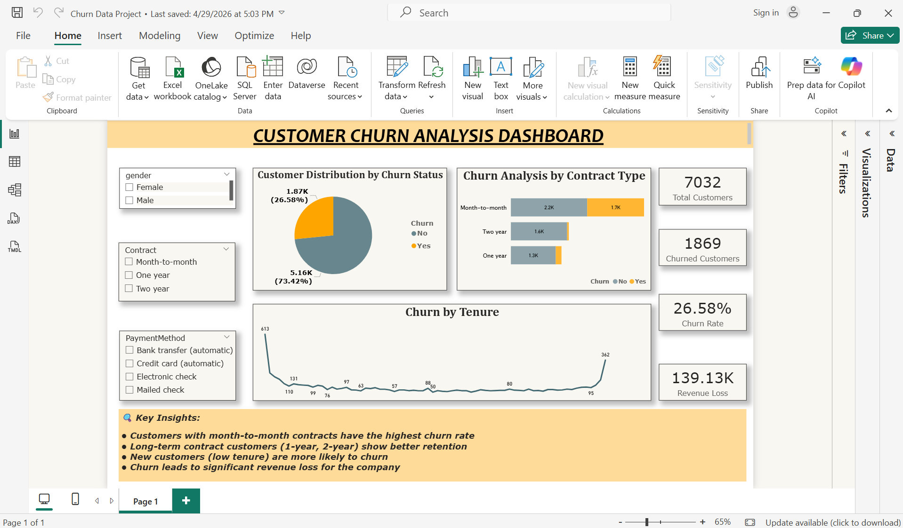

# Churn Data Project

Power BI dashboard analyzing 1,500+ customer records to identify churn drivers and retention-risk segments.

## Tools Used
- Power BI

## Key Highlights
- Segmented customers by churn risk
- Tracked retention and revenue-impact KPIs

