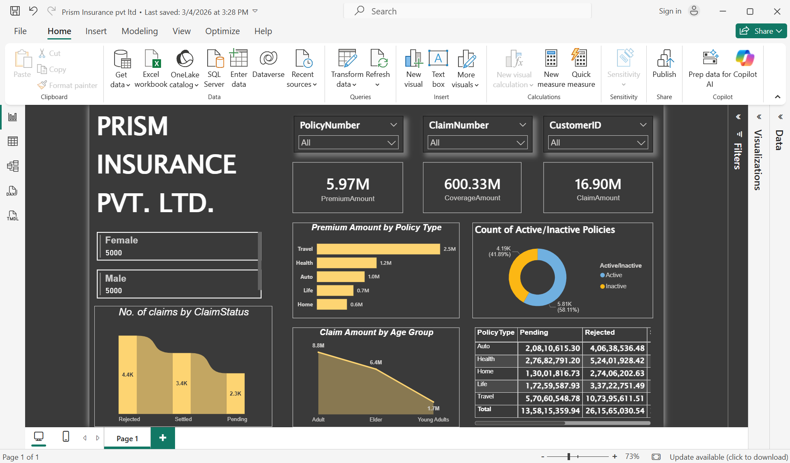

# Prism Insurance Analytics

Power BI dashboard evaluating policy performance and profitability KPIs across an insurance portfolio.

## Tools Used
- Power BI
- Excel

## Key Highlights
- Analyzed policy-level data to surface profitability trends
- Built KPI tracking for premium, claims, and retention metrics

