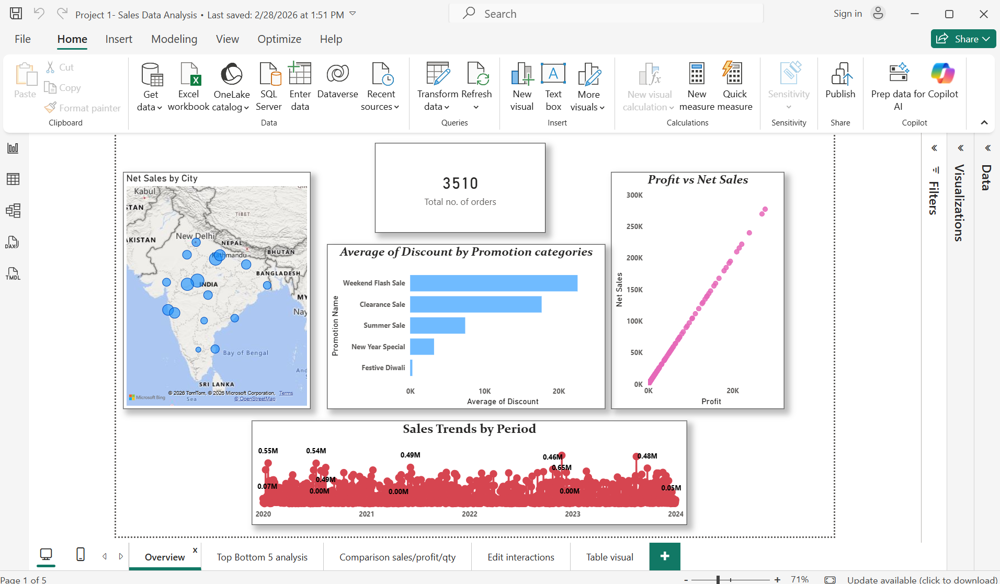
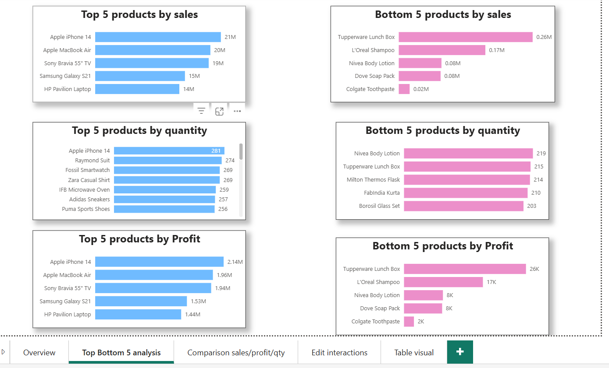

# Sales Data Analysis

Tableau/Excel dashboard tracking revenue, growth, and regional sales performance trends.

## Tools Used
- Tableau
- Microsoft Excel

## Key Highlights
- Tracked revenue and growth trends across regions
- Built KPI views for performance monitoring

