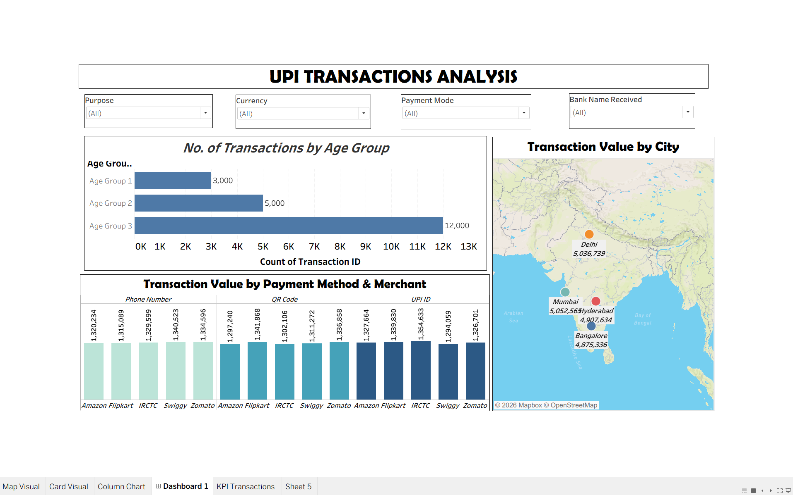

# UPI Transactions Analysis — Tableau

Interactive Tableau dashboard analysing 20,000 UPI transactions (~19.9M in total value) to understand who is transacting, where, and how.

## Business Questions
- Which customer age group drives the most transactions?
- How is transaction value distributed across cities?
- Which merchants and payment methods (QR Code, UPI ID, Phone Number) carry the most value?

## Dashboard Contents
- **No. of Transactions by Age Group:** transaction volume across three age groups
- **Transaction Value by City:** map of Delhi, Mumbai, Hyderabad, and Bangalore
- **Transaction Value by Payment Method & Merchant:** Amazon, Flipkart, IRCTC, Swiggy, Zomato across three payment methods
- **Interactive filters:** Purpose, Currency, Payment Mode, Bank Name Received

## Key Insights
- **Age Group 3 accounts for 60% of all transactions** (12,000 of 20,000), making it the core user segment.
- **Value is evenly spread across cities:** Mumbai leads narrowly (5.05M), followed by Delhi (5.04M), Hyderabad (4.91M), and Bangalore (4.88M).
- **No single payment method dominates:** QR Code, UPI ID, and Phone Number each carry ~6.6M.
- **Merchant value is balanced** at ~3.9–4.0M each, with average transaction value around 994.

## Tools
Tableau Public · Microsoft Excel
